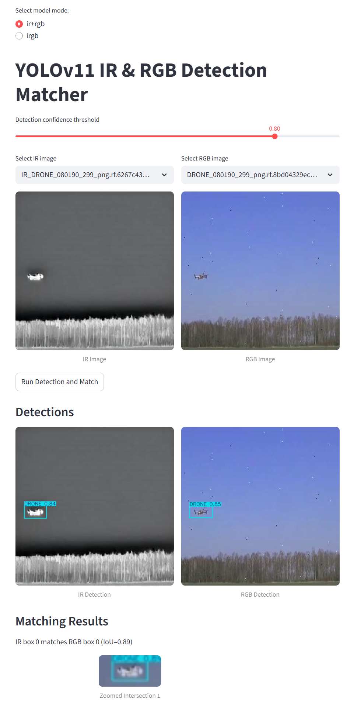
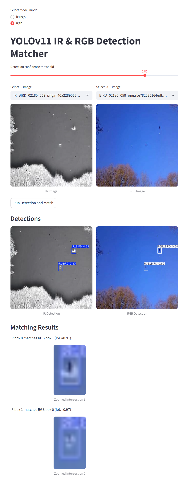

# IRGB Drone/Bird Detection Project

This project provides tools for training and evaluating YOLOv11s models on IR and RGB drone/bird datasets, and a Streamlit web UI for visualizing and matching detections.

## Contents
- `train.py`: Script to train a YOLOv11s model using the Ultralytics library on your dataset.
- `web.py`: Streamlit web application for comparing and matching detections between IR and RGB images using trained models.
- `requirements.txt`: List of required Python packages.

---

## 1. Training a Model (`train.py`)

This script trains a YOLOv11s model using the Ultralytics library. You can configure dataset paths, epochs, batch size, and other parameters in the script.

**Usage:**
```bash
python train.py
```

- The script expects a dataset YAML file (e.g., `irgb/data.yaml`) describing your dataset structure and class names.
- Training results and weights will be saved in the `runs/train/` directory.

---

## 2. Web UI for Detection Matching (`web.py`)

The app allows you to:
- Select between using separate IR/RGB models or a combined IRGB model.
- Choose IR and RGB test images.
- Run object detection on both images.
- Visualize detections side by side.
- Automatically match intersecting bounding boxes and display zoomed overlays of intersections.
- Adjust detection confidence threshold interactively.

**Usage:**
```bash
streamlit run web.py
```

- Make sure your trained model weights are in the correct paths (see the top of `web.py`).
- The app will load available test images from the dataset folders.

**Screenshots:**
- > IR + RGB Drone Detection


- > IRGB Bird Detection


---

## 3. Requirements (`requirements.txt`)

Install all dependencies with:
```bash
pip install -r requirements.txt
```

**Main dependencies:**
- ultralytics
- streamlit
- Pillow
- numpy
- torch

---

## Notes
- Ensure your dataset structure matches the paths in the scripts.
- For the IRGB model, class names should be: `['IR_BIRD', 'IR_DRONE', 'RGB_BIRD', 'RGB_DRONE']`.
- For separate IR/RGB models, class names should be: `['BIRD', 'DRONE']`.
- You can adjust training and UI parameters as needed for your experiments.

---

